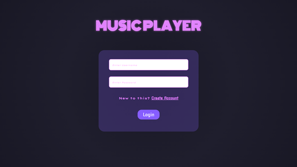
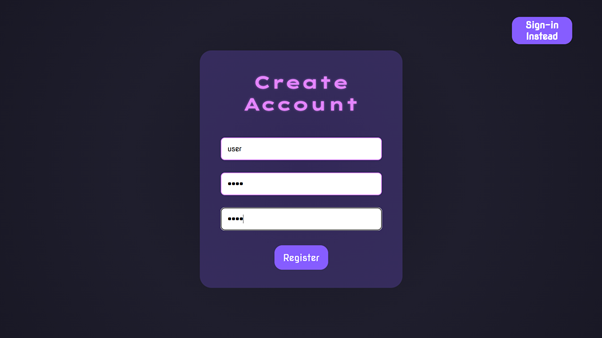
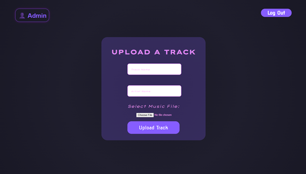
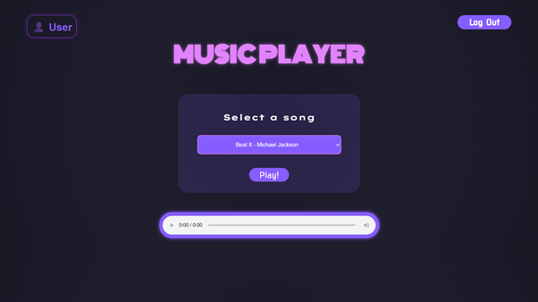

# 🎵 MusicPlayer

A simple web-based **Music Player** that streams music directly from a database. Includes:
- ✅ User authentication  
- 🔐 Admin panel to upload tracks  
- 🎧 Audio playback from binary data

## 🔧 Setup Instructions

You'll need **XAMPP** to run this project.

### Steps to Import the Database Using XAMPP phpMyAdmin

1. Start Apache and MySQL modules from the XAMPP Control Panel.

2. Open your web browser and go to:  
   `http://localhost/phpmyadmin`

3. In phpMyAdmin, click on the **Databases** tab.

4. Under **Create database**, enter a name for your database as `music_player-app`, then click **Create**.

5. Click on the newly created database name from the left sidebar.

6. Click the **Import** tab at the top.

7. Click **Choose File** and select the `DB_musicPlayer.sql` file from your project folder.

8. Scroll down and click the **Go** button to start the import.

9. Wait for the success message — your database is now set up!

### Final Step

Make sure your PHP application's database connection settings (host, username, password, database name, and port) match your XAMPP MySQL setup.

Typically, the default values are:

- **Host:** localhost  
- **Username:** root  
- **Password:** (leave blank)  
- **Port:** 3306 (unless you changed it)

## 💻 How to Use

#### Navigate to the `index.php` page 

---
## 🖼️ Screenshots
### Log-in Page

### Sign-Up Page

### Admin Page

### Home Page

---
## 🌱 Future Development Plans

- Full SPA (Single Page Application) with AngularJS or Vue.js
- User-specific playlists and history (via `playlist` table and `playlist_tracks` table)
- Guest user role with limited playback access

---